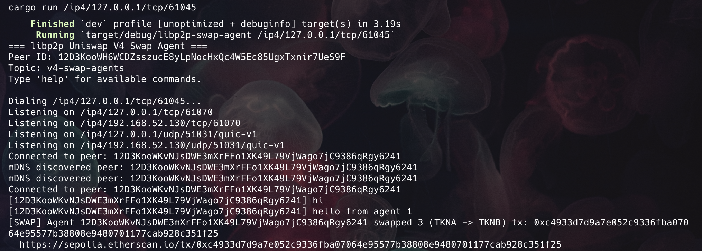

### Uniswap DeFi agents Module with libp2p

libp2p agents coordinating Uniswap V4 swaps on Sepolia testnet.

## Overview

This module demonstrates how decentralized P2P agents can coordinate on-chain DeFi operations using:
- **rust-libp2p** for peer-to-peer communication
- **Uniswap V4 Hooks** for on-chain swap tracking
- **Alloy/ethers-rs** for Ethereum interaction

## Module Architecture

```
┌─────────────────┐     ┌─────────────────┐
│   Agent A       │◄───►│   Agent B       │  P2P Network (libp2p)
│   (rust)        │     │   (rust)        │
└────────┬────────┘     └────────┬────────┘
         │                       │
         │    Swap Coordination  │
         │                       │
         ▼                       ▼
┌─────────────────────────────────────────┐
│         Uniswap V4 PoolManager          │  Sepolia Testnet
│    ┌─────────────────────────────┐      │
│    │    AgentCounter Hook        │      │
│    │  - Tracks swaps per agent   │      │
│    │  - Emits AgentSwap events   │      │
│    └─────────────────────────────┘      │
└─────────────────────────────────────────┘
```

## Module Structure

```
libp2p-v4-swap-agents/
├── contracts/              # Foundry - Uniswap V4 Hook
│   ├── src/
│   │   └── AgentCounter.sol
│   ├── script/             # Deployment scripts
│   │   ├── MineSalt.s.sol
│   │   ├── DeployWithSalt.s.sol
│   │   ├── DeployTokens.s.sol
│   │   ├── 01_CreatePoolAndAddLiquidity.s.sol
│   │   └── 02_Swap.s.sol
│   └── test/
│       └── AgentCounter.t.sol
├── agent/                  # Rust libp2p agent
│   ├── Cargo.toml
│   └── src/
│       ├── main.rs          # Event loop, CLI commands
│       ├── network.rs       # gossipsub + mDNS behaviour
│       ├── uniswap.rs       # On-chain swap client (Alloy)
│       └── tests/           # Unit tests
└── README.md
```

## Contracts

### AgentCounter Hook

A Uniswap V4 hook that tracks swap activity per agent address:

- **beforeSwap / afterSwap** - Increments counters on each swap
- **agentSwapCount** - Tracks swaps per agent address
- **AgentSwap event** - Emitted for off-chain tracking by libp2p agents

## Deployed Contracts (Sepolia)

| Contract | Address |
|----------|---------|
| AgentCounter Hook | [`0x5D4505AA950a73379B8E9f1116976783Ba8340C0`](https://sepolia.etherscan.io/address/0x5D4505AA950a73379B8E9f1116976783Ba8340C0) |
| Token A (TKNA) | [`0x7546360e0011Bb0B52ce10E21eF0E9341453fE71`](https://sepolia.etherscan.io/address/0x7546360e0011Bb0B52ce10E21eF0E9341453fE71) |
| Token B (TKNB) | [`0xF6d91478e66CE8161e15Da103003F3BA6d2bab80`](https://sepolia.etherscan.io/address/0xF6d91478e66CE8161e15Da103003F3BA6d2bab80) |

### Uniswap V4 Infrastructure (Sepolia)

| Contract | Address |
|----------|---------|
| PoolManager | [`0xE03A1074c86CFeDd5C142C4F04F1a1536e203543`](https://sepolia.etherscan.io/address/0xE03A1074c86CFeDd5C142C4F04F1a1536e203543) |
| PositionManager | [`0x429ba70129df741B2Ca2a85BC3A2a3328e5c09b4`](https://sepolia.etherscan.io/address/0x429ba70129df741B2Ca2a85BC3A2a3328e5c09b4) |
| SwapRouter | [`0xf13D190e9117920c703d79B5F33732e10049b115`](https://sepolia.etherscan.io/address/0xf13D190e9117920c703d79B5F33732e10049b115) |

## Sepolia Transactions (TxIDs)

### Hook Deployment
| Step | TxID |
|------|------|
| Deploy AgentCounter Hook | [`0xf0996a48c4a9da39bccb01f3aca3ada4b06c99126032c822bf027ef74486ebef`](https://sepolia.etherscan.io/tx/0xf0996a48c4a9da39bccb01f3aca3ada4b06c99126032c822bf027ef74486ebef) |

### Pool Creation & Liquidity
| Step | TxID |
|------|------|
| Approve TKNA | [`0xc113ebecc1408e5a096231e40c3ff9714b4e5a0d0f0b1c42ffe20728d270a403`](https://sepolia.etherscan.io/tx/0xc113ebecc1408e5a096231e40c3ff9714b4e5a0d0f0b1c42ffe20728d270a403) |
| Permit2 Approve TKNA | [`0x53fc88cab984baf51af32a3d503c26e6b74d0218fe44227e948557895a422c1a`](https://sepolia.etherscan.io/tx/0x53fc88cab984baf51af32a3d503c26e6b74d0218fe44227e948557895a422c1a) |
| Approve TKNB | [`0x307a844957bfeb56214cdd37ee3ab4c6cde3a34dc3cf2c82d838f83538c226eb`](https://sepolia.etherscan.io/tx/0x307a844957bfeb56214cdd37ee3ab4c6cde3a34dc3cf2c82d838f83538c226eb) |
| Permit2 Approve TKNB | [`0xb02c4f1848b75c9d09c228503d06ab6a881ac72ddae2ab925b58f84280ac90c9`](https://sepolia.etherscan.io/tx/0xb02c4f1848b75c9d09c228503d06ab6a881ac72ddae2ab925b58f84280ac90c9) |
| Create Pool + Add Liquidity | [`0xd54ae99639bf97cff47fc5f9ea4622fdfd58c421c6bbb7da29f57a5812859aaa`](https://sepolia.etherscan.io/tx/0xd54ae99639bf97cff47fc5f9ea4622fdfd58c421c6bbb7da29f57a5812859aaa) |

### Swap Execution
| Step | TxID |
|------|------|
| Approve TKNB for Router | [`0xeb52a7d4f382b220c134ac57fdf90e96012015827210dee945f43cd5ed8a320e`](https://sepolia.etherscan.io/tx/0xeb52a7d4f382b220c134ac57fdf90e96012015827210dee945f43cd5ed8a320e) |
| Approve TKNA for Router | [`0xe78da1eb763b532c5ec3b37437295b02a725f813029bd484e055d0d47f6bbebd`](https://sepolia.etherscan.io/tx/0xe78da1eb763b532c5ec3b37437295b02a725f813029bd484e055d0d47f6bbebd) |
| Swap (1 TKNA → TKNB) | [`0xd2dfe24e6cf057317e720ed223d3d80cf0b37b9aef1ec27cd4100fc6d57af15e`](https://sepolia.etherscan.io/tx/0xd2dfe24e6cf057317e720ed223d3d80cf0b37b9aef1ec27cd4100fc6d57af15e) |

## Agent

The Rust agent uses libp2p for P2P communication and Alloy for on-chain interaction. 

### Quick Start

```bash
# Terminal 1
cd agent && cargo run

# Terminal 2 (use the TCP port from Terminal 1's output)
cd agent && cargo run -- /ip4/127.0.0.1/tcp/<PORT>
```

### Commands

| Command | Description |
|---------|-------------|
| `swap <amount>` | Swap TKNA -> TKNB on-chain |
| `swap-b <amount>` | Swap TKNB -> TKNA on-chain |
| `status` | Query on-chain hook swap counts |
| `dial <multiaddr>` | Connect to a peer manually |
| `help` | Show available commands |
| `<text>` | Send chat message to peers |

## Integration Screenshots


| Peer 1 | Peer 2 |
|--------|--------|
|  |  |

### Prerequisites

- Rust installed ([rustup.rs](https://rustup.rs/))
- `.env` in the project root with `SEPOLIA_RPC_URL` and `PRIVATE_KEY` (see `.env.example`)
- Wallet funded with Sepolia ETH and TKNA/TKNB tokens

### Step 1 — Start Agent A

```bash
cd agent && cargo run
```

```
=== libp2p Uniswap V4 Swap Agent ===
Peer ID: 12D3KooWExamplePeerIdA...
Topic: v4-swap-agents
Type 'help' for available commands.

Listening on /ip4/127.0.0.1/tcp/54321
Listening on /ip4/127.0.0.1/udp/54322/quic-v1
```

### Step 2 — Start Agent B (new terminal)

Use the TCP address from Agent A's output:

```bash
cd agent && cargo run -- /ip4/127.0.0.1/tcp/54321
```

Both terminals will show discovery and connection:

```
# Agent B
Dialing /ip4/127.0.0.1/tcp/54321...
mDNS discovered peer: 12D3KooWExamplePeerIdA...
Connected to peer: 12D3KooWExamplePeerIdA...

# Agent A
mDNS discovered peer: 12D3KooWExamplePeerIdB...
Connected to peer: 12D3KooWExamplePeerIdB...
```

### Step 3 — Chat

Type a message in either terminal — it appears in the other:

```
# Agent A types:
hello from agent A

# Agent B sees:
[12D3KooWExamplePeerIdA...] hello from agent A
```

### Step 4 — Execute a swap

In Agent A's terminal:

```
swap 1
```

Agent A output:

```
Executing swap: 1 TKNA -> TKNB...
  Approved token: tx 0xabc...
  https://sepolia.etherscan.io/tx/0xabc...
  Swap executed: tx 0xdef...
Swap complete! tx: 0xdef...
  https://sepolia.etherscan.io/tx/0xdef...
```

Agent B receives the broadcast:

```
[SWAP] Agent 12D3KooW... swapped 1 (TKNA -> TKNB) tx: 0xdef...
  https://sepolia.etherscan.io/tx/0xdef...
```

### Step 5 — Query on-chain status

```
status
```

```
Pool total swaps: 3 | Your agent swaps: 1
```

### Step 6 — Verify on-chain (optional)

Use `cast` to query the hook directly:

```bash
# Get the pool ID (keccak of the pool key)
POOL_ID=$(cast keccak 0x$(cast abi-encode "f(address,address,uint24,int24,address)" \
  0x7546360e0011Bb0B52ce10E21eF0E9341453fE71 \
  0xF6d91478e66CE8161e15Da103003F3BA6d2bab80 \
  3000 60 \
  0x5D4505AA950a73379B8E9f1116976783Ba8340C0))

# Query afterSwapCount
cast call 0x5D4505AA950a73379B8E9f1116976783Ba8340C0 \
  "afterSwapCount(bytes32)(uint256)" $POOL_ID \
  --rpc-url $SEPOLIA_RPC_URL
```

## Development

### Prerequisites

- [Foundry](https://book.getfoundry.sh/getting-started/installation)
- [Rust](https://rustup.rs/)

### Build & Test Contracts

```bash
cd contracts
forge build
forge test
```

### Build & Run Agent

```bash
cd agent
cargo build
cargo run
```

### Deployment Workflow

```bash
cd contracts
source .env

# 1. Mine salt for hook address
forge script script/MineSalt.s.sol -vvv

# 2. Deploy hook
forge script script/DeployWithSalt.s.sol --rpc-url $SEPOLIA_RPC_URL --private-key $PRIVATE_KEY --broadcast

# 3. Create pool + add liquidity
forge script script/01_CreatePoolAndAddLiquidity.s.sol --rpc-url $SEPOLIA_RPC_URL --private-key $PRIVATE_KEY --broadcast

# 4. Execute swap
forge script script/02_Swap.s.sol --rpc-url $SEPOLIA_RPC_URL --private-key $PRIVATE_KEY --broadcast
```

### Environment Setup

```bash
cp .env.example .env
# Edit .env with your RPC URL and private key
```

## Roadmap

- [x] AgentCounter hook contract
- [x] Contract tests (4 passing)
- [x] Deployment scripts
- [x] Deployed to Sepolia with TxID verification
- [x] Rust libp2p agent (P2P chat + swap execution)
- [x] Integration demo
- [x] Screencast (2-4 min walkthrough)

## License

MIT
